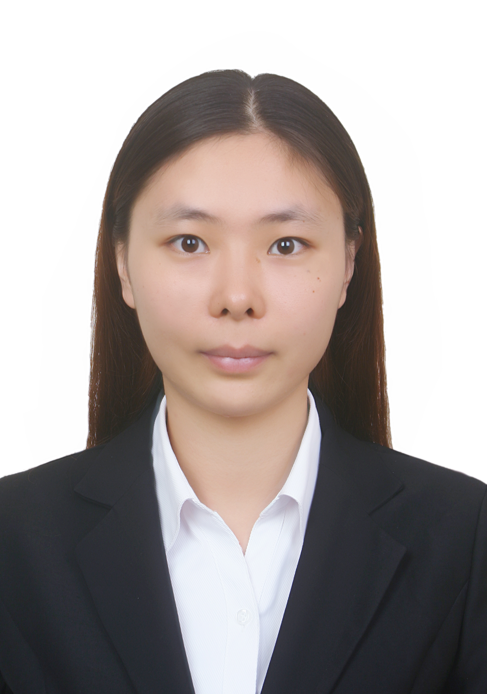

</cener>

# 陈妍
---

## 研究方向
* 资料同化方法：粒子滤波、集合卡尔曼滤波
* 海洋资料同化
* 大气资料同化

## 研究成果
[1]Fei, T.; Huang, B.; Wang, X.; Zhu, J.; **Chen, Y.**; Wang, H.; Zhang, W.[A Hybrid Deep Learning Model for the Bias Correction of SST Numerical Forecast Products Using Satellite Data](../assets/papers/cy-2022-remotesensing-14-01339.pdf),Remote Sens. 2022, 14, 1339. https://doi.org/10.3390/rs14061339

[2] **陈妍**，朱孟斌，张卫民, 2018.[隐式等权重粒子滤波在高维准地转模式中特性研究](http://www.cmsjournal.net/qxxb_cn/ch/reader/create_pdf.aspx?file_no=2017090&flag=1&journal_id=qxxb_cn&year_id=2018).气象学报，ISTP.

[3] **Yan Chen**, Weimin Zhang, Mengbin Zhu,2019. [A Localized Weighted Ensemble Kalman Filter for High-Dimensional Systems](../assets/papers/A-Localized-Weighted-Ensemble-Kalman-_Filter-for-High-Dimensional-Systems.pdf)[J].  Quarterly Journal of the Royal Meteorological Society, 2019, 146(726). DOI：10.1002/qj.3685.

[4] **Chen, Yan**, Zhang, Weimin, & Wang, Pinqiang. [An application of the localized weighted ensemble Kalman filter for ocean data assimilation.](../assets/papers/Chen-2020-An-application-of-the-localized-weig.pdf.pdf)  Quarterly Journal of the Royal Meteorological Society, 2020, 146(732), 3029–3047. doi: 10.1002/qj.3824

[5] Wang Pingqiang, Zhu Mengbin, **Chen Yan**, Zhang Weimin, & Yu Yi (2021). [Ocean satellite data assimilation using the implicit equal-weights variational particle smoother](../assets/papers/Wangpq-2021-Ocean+satellite+data+assimilation+us.pdf),Ocean Modelling,164, https://doi.org/10.1016/j.ocemod.2021.101833.

[6] Wang, H., **Chen, Y**. & Zhang, W. [Some progress on ocean data assimilation in China: Introduction of the special section “Ocean Data Assimilation”](/assets/papers/Wanghz-2022-Some+progress+on+ocean+data+assimilation+in+China.pdf). Acta Oceanol. Sin. 41, 1–2 (2022). https://doi.org/10.1007/s13131-021-1982-0

[7] Shen, M., **Chen, Y**., Wang, P. , & Zhang, W. . (2022). [Assimilating satellite sst/ssh andin-situ t/sprofiles with the localized weighted ensemble kalman filter](../assets/papers/Shen-2022-Assimilation+Satellite+SSTSSH+and+in-situ+TS+Profiles.pdf). Acta Oceanologica Sinica, 41(2), 26-40.

[8] Wang, Pinqiang, Zhu, Mengbin, **Chen, Yan**, & Zhang, Weimin. [Implicit Equal-Weights Variational Particle Smoother.](../assets/papers/Wang-2020-Implicit-Equal-Weights-Variational-P.pdf)  Atmosphere, 2020, 11(4), 338.

## 毕业论文
* 博士：[局地加权集合卡尔曼滤波方法及其应用](../assets/dissertations/陈妍-局地加权集合卡尔曼滤波方法及其应用.pdf)

## 联系方式
* 邮箱: cy_msc@126.com
